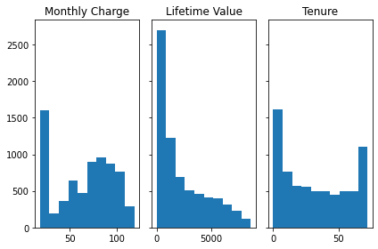
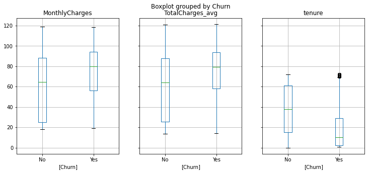
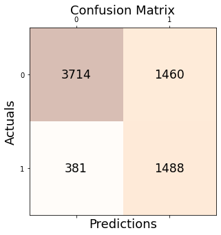
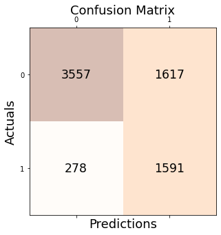
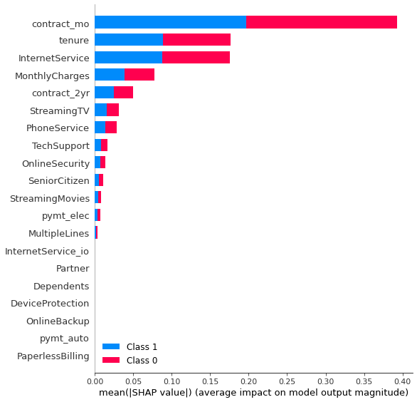
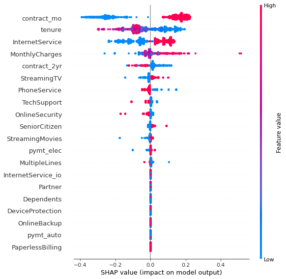

# Predicting the churn - An example customer data

Using an example telecomm subscription data in building models predicting customer churns, the following exercise showcase,

* Importance of addressing data imbalance, such as customer churn data, where data consists of significantly smaller subset of observations with success features
  * Implication on decisions and an example of making a 'judgement call' based on first-order objectives
* Leveraging Shapley values to explain and prescribe business recommendations


```python
import pandas as pd
import numpy as np
from matplotlib import pyplot as plt

from sklearn.preprocessing import LabelBinarizer

from sklearn.model_selection import cross_val_score
from sklearn.model_selection import train_test_split
from sklearn.metrics import confusion_matrix
from sklearn.metrics import precision_score, recall_score, f1_score, accuracy_score
from sklearn.utils import resample

from sklearn.linear_model import LogisticRegression
from sklearn.tree import DecisionTreeClassifier
# For visualizing the tree
from sklearn.tree import export_graphviz
from sklearn import tree

!pip install shap -q
import shap
```

         |████████████████████████████████| 564 kB 5.0 MB/s 
    [?25h


```python
# Import data from the public domain
df = pd.read_csv("https://raw.githubusercontent.com/erood/interviewqs.com_code_snippets/master/Datasets/teleco_user_data.csv")
df.head(3)
```


  <div id="df-85fa8e52-822f-43a6-be24-e56a93c95da1">
    <div class="colab-df-container">
      <div>
<style scoped>
    .dataframe tbody tr th:only-of-type {
        vertical-align: middle;
    }

    .dataframe tbody tr th {
        vertical-align: top;
    }

    .dataframe thead th {
        text-align: right;
    }
</style>
<table border="1" class="dataframe">
  <thead>
    <tr style="text-align: right;">
      <th></th>
      <th>customerID</th>
      <th>gender</th>
      <th>SeniorCitizen</th>
      <th>Partner</th>
      <th>Dependents</th>
      <th>tenure</th>
      <th>PhoneService</th>
      <th>MultipleLines</th>
      <th>InternetService</th>
      <th>OnlineSecurity</th>
      <th>OnlineBackup</th>
      <th>DeviceProtection</th>
      <th>TechSupport</th>
      <th>StreamingTV</th>
      <th>StreamingMovies</th>
      <th>Contract</th>
      <th>PaperlessBilling</th>
      <th>PaymentMethod</th>
      <th>MonthlyCharges</th>
      <th>TotalCharges</th>
      <th>Churn</th>
    </tr>
  </thead>
  <tbody>
    <tr>
      <th>0</th>
      <td>7590-VHVEG</td>
      <td>Female</td>
      <td>0</td>
      <td>Yes</td>
      <td>No</td>
      <td>1</td>
      <td>No</td>
      <td>No phone service</td>
      <td>DSL</td>
      <td>No</td>
      <td>Yes</td>
      <td>No</td>
      <td>No</td>
      <td>No</td>
      <td>No</td>
      <td>Month-to-month</td>
      <td>Yes</td>
      <td>Electronic check</td>
      <td>29.85</td>
      <td>29.85</td>
      <td>No</td>
    </tr>
    <tr>
      <th>1</th>
      <td>5575-GNVDE</td>
      <td>Male</td>
      <td>0</td>
      <td>No</td>
      <td>No</td>
      <td>34</td>
      <td>Yes</td>
      <td>No</td>
      <td>DSL</td>
      <td>Yes</td>
      <td>No</td>
      <td>Yes</td>
      <td>No</td>
      <td>No</td>
      <td>No</td>
      <td>One year</td>
      <td>No</td>
      <td>Mailed check</td>
      <td>56.95</td>
      <td>1889.5</td>
      <td>No</td>
    </tr>
    <tr>
      <th>2</th>
      <td>3668-QPYBK</td>
      <td>Male</td>
      <td>0</td>
      <td>No</td>
      <td>No</td>
      <td>2</td>
      <td>Yes</td>
      <td>No</td>
      <td>DSL</td>
      <td>Yes</td>
      <td>Yes</td>
      <td>No</td>
      <td>No</td>
      <td>No</td>
      <td>No</td>
      <td>Month-to-month</td>
      <td>Yes</td>
      <td>Mailed check</td>
      <td>53.85</td>
      <td>108.15</td>
      <td>Yes</td>
    </tr>
  </tbody>
</table>
</div>
      <button class="colab-df-convert" onclick="convertToInteractive('df-85fa8e52-822f-43a6-be24-e56a93c95da1')"
              title="Convert this dataframe to an interactive table."
              style="display:none;">

  <svg xmlns="http://www.w3.org/2000/svg" height="24px"viewBox="0 0 24 24"
       width="24px">
    <path d="M0 0h24v24H0V0z" fill="none"/>
    <path d="M18.56 5.44l.94 2.06.94-2.06 2.06-.94-2.06-.94-.94-2.06-.94 2.06-2.06.94zm-11 1L8.5 8.5l.94-2.06 2.06-.94-2.06-.94L8.5 2.5l-.94 2.06-2.06.94zm10 10l.94 2.06.94-2.06 2.06-.94-2.06-.94-.94-2.06-.94 2.06-2.06.94z"/><path d="M17.41 7.96l-1.37-1.37c-.4-.4-.92-.59-1.43-.59-.52 0-1.04.2-1.43.59L10.3 9.45l-7.72 7.72c-.78.78-.78 2.05 0 2.83L4 21.41c.39.39.9.59 1.41.59.51 0 1.02-.2 1.41-.59l7.78-7.78 2.81-2.81c.8-.78.8-2.07 0-2.86zM5.41 20L4 18.59l7.72-7.72 1.47 1.35L5.41 20z"/>
  </svg>
      </button>

  <style>
    .colab-df-container {
      display:flex;
      flex-wrap:wrap;
      gap: 12px;
    }

    .colab-df-convert {
      background-color: #E8F0FE;
      border: none;
      border-radius: 50%;
      cursor: pointer;
      display: none;
      fill: #1967D2;
      height: 32px;
      padding: 0 0 0 0;
      width: 32px;
    }

    .colab-df-convert:hover {
      background-color: #E2EBFA;
      box-shadow: 0px 1px 2px rgba(60, 64, 67, 0.3), 0px 1px 3px 1px rgba(60, 64, 67, 0.15);
      fill: #174EA6;
    }

    [theme=dark] .colab-df-convert {
      background-color: #3B4455;
      fill: #D2E3FC;
    }

    [theme=dark] .colab-df-convert:hover {
      background-color: #434B5C;
      box-shadow: 0px 1px 3px 1px rgba(0, 0, 0, 0.15);
      filter: drop-shadow(0px 1px 2px rgba(0, 0, 0, 0.3));
      fill: #FFFFFF;
    }
  </style>

      <script>
        const buttonEl =
          document.querySelector('#df-85fa8e52-822f-43a6-be24-e56a93c95da1 button.colab-df-convert');
        buttonEl.style.display =
          google.colab.kernel.accessAllowed ? 'block' : 'none';

        async function convertToInteractive(key) {
          const element = document.querySelector('#df-85fa8e52-822f-43a6-be24-e56a93c95da1');
          const dataTable =
            await google.colab.kernel.invokeFunction('convertToInteractive',
                                                     [key], {});
          if (!dataTable) return;

          const docLinkHtml = 'Like what you see? Visit the ' +
            '<a target="_blank" href=https://colab.research.google.com/notebooks/data_table.ipynb>data table notebook</a>'
            + ' to learn more about interactive tables.';
          element.innerHTML = '';
          dataTable['output_type'] = 'display_data';
          await google.colab.output.renderOutput(dataTable, element);
          const docLink = document.createElement('div');
          docLink.innerHTML = docLinkHtml;
          element.appendChild(docLink);
        }
      </script>
    </div>
  </div>


```python
print(df.columns)
```

    Index(['customerID', 'gender', 'SeniorCitizen', 'Partner', 'Dependents',
           'tenure', 'PhoneService', 'MultipleLines', 'InternetService',
           'OnlineSecurity', 'OnlineBackup', 'DeviceProtection', 'TechSupport',
           'StreamingTV', 'StreamingMovies', 'Contract', 'PaperlessBilling',
           'PaymentMethod', 'MonthlyCharges', 'TotalCharges', 'Churn'],
          dtype='object')
    

## Understanding the data and feature engineering 

### Identifying variables and grouping the types


```python
# Binary choice with conditional default values (N/A)
print(df.MultipleLines.unique())
# Nested with column PhoneService

# Below are nested with information,
#   if the customer has the internet subscription or not.
print(df.OnlineSecurity.unique())
print(df.OnlineBackup.unique())
print(df.DeviceProtection.unique())
print(df.TechSupport.unique())
print(df.StreamingTV.unique())
print(df.StreamingMovies.unique())

print(df.InternetService.unique())
# If they have internet subscription, then there are two types and options.

# Woult first break down into internet service or not.
# then dissect with time
print(df.Contract.unique())
# Subscription can be based on a contract (one-year or two-year) or not

print(df.PaymentMethod.unique())
# Can be automatic or not
# Can be snail or electronic 
```

    ['No phone service' 'No' 'Yes']
    ['No' 'Yes' 'No internet service']
    ['Yes' 'No' 'No internet service']
    ['No' 'Yes' 'No internet service']
    ['No' 'Yes' 'No internet service']
    ['No' 'Yes' 'No internet service']
    ['No' 'Yes' 'No internet service']
    ['DSL' 'Fiber optic' 'No']
    ['Month-to-month' 'One year' 'Two year']
    ['Electronic check' 'Mailed check' 'Bank transfer (automatic)'
     'Credit card (automatic)']
    

Continuous variable, whcih can be translated to categorical variable or left as continuous variable.


```python
print(df.MonthlyCharges.unique()) # monthly charge (average)
print(df.TotalCharges.unique()) # lifetime value
print(df.tenure.unique()) # ordinal variable
```

    [29.85 56.95 53.85 ... 63.1  44.2  78.7 ]
    ['29.85' '1889.5' '108.15' ... '346.45' '306.6' '6844.5']
    [ 1 34  2 45  8 22 10 28 62 13 16 58 49 25 69 52 71 21 12 30 47 72 17 27
      5 46 11 70 63 43 15 60 18 66  9  3 31 50 64 56  7 42 35 48 29 65 38 68
     32 55 37 36 41  6  4 33 67 23 57 61 14 20 53 40 59 24 44 19 54 51 26  0
     39]
    

#### Binary variables


```python
print(df.gender.unique())
print(df.SeniorCitizen.unique()) # No need to translate, already binary
print(df.Partner.unique())
print(df.Dependents.unique())
print(df.PhoneService.unique())

# What the KPI/response variable would be.
print(df.Churn.unique())
```

    ['Female' 'Male']
    [0 1]
    ['Yes' 'No']
    ['No' 'Yes']
    ['No' 'Yes']
    ['No' 'Yes']
    


```python
dff = df.copy(deep = True)
# dataframe used for the analysis and model feed.

dff['gender'] = np.where(dff['gender'].str.contains('Female'), 1, 0)

# This is a nested column condition on 'PhoneService' column
dff['MultipleLines'] = np.where(dff['MultipleLines'].str.contains('Yes'), 1, 0)


# ..............................................................................
# Subscription: For those in contract, either monthly, one year, or two years
dff['Contract'].replace({'Month-to-month':'contract_mo', 
                         'One year':'contract_1yr',
                         'Two year':'contract_2yr'}, inplace = True)
# Use sklearn's encoder - create binary columns for 
lb = LabelBinarizer()
lb_results = lb.fit_transform(dff['Contract'])
lb_results_df = pd.DataFrame(lb_results, columns=lb.classes_)

dff = pd.concat([dff, lb_results_df], axis = 1)
# Drop the string column
dff.drop(columns = ['Contract'], inplace = True)

# Note that for models requiring orthogonality considerations, one should
#   consider removing 'contract_mo' column. The variation will be represented by
#   value zero's in both 'contract-1yr' and 'contract-2yr.'

# ..............................................................................
# Payment method:
# I am identifying two attributes relevant: electronic or automatic payment
# (a) Electronic or not
dff['pymt_elec'] = np.where(dff['PaymentMethod'].str.contains('Mailed check'), 0, 1)
# (b) automatic payment or not
dff['pymt_auto'] = np.where(dff['PaymentMethod'].str.contains('automatic'), 1, 0)
# Other data view may not be useful in interpreting the results of the churn trend
dff.drop(columns = ['PaymentMethod'], inplace = True)
# ..............................................................................
# For other already-binary columns:

# Generate column for internet service 
dff['InternetService_io'] = np.where(dff['InternetService'].str.contains('No'), 0, 1)
# What type of internet service, Fiber optics? (this column is nested to prev.)
dff['InternetService'] = np.where(dff['InternetService'].str.contains('Fiber optic'), 1, 0)

# For columns requiring binary encoding with Yes/No
list_binaryCols = ['Partner', 'Dependents', 'PhoneService',
                   'OnlineSecurity', 'OnlineBackup', 'DeviceProtection',
                   'TechSupport', 'StreamingTV', 'StreamingMovies',
                   'PaperlessBilling'
                   ]
for iter in list_binaryCols:
    dff[iter] = np.where(dff[iter].str.contains('Yes'), 1, 0)
dff.head(5)
```


  <div id="df-2ea0f7fd-8fab-4689-adbf-8aa04e2eaa0e">
    <div class="colab-df-container">
      <div>
<style scoped>
    .dataframe tbody tr th:only-of-type {
        vertical-align: middle;
    }

    .dataframe tbody tr th {
        vertical-align: top;
    }

    .dataframe thead th {
        text-align: right;
    }
</style>
<table border="1" class="dataframe">
  <thead>
    <tr style="text-align: right;">
      <th></th>
      <th>customerID</th>
      <th>gender</th>
      <th>SeniorCitizen</th>
      <th>Partner</th>
      <th>Dependents</th>
      <th>tenure</th>
      <th>PhoneService</th>
      <th>MultipleLines</th>
      <th>InternetService</th>
      <th>OnlineSecurity</th>
      <th>OnlineBackup</th>
      <th>DeviceProtection</th>
      <th>TechSupport</th>
      <th>StreamingTV</th>
      <th>StreamingMovies</th>
      <th>PaperlessBilling</th>
      <th>MonthlyCharges</th>
      <th>TotalCharges</th>
      <th>Churn</th>
      <th>contract_1yr</th>
      <th>contract_2yr</th>
      <th>contract_mo</th>
      <th>pymt_elec</th>
      <th>pymt_auto</th>
      <th>InternetService_io</th>
    </tr>
  </thead>
  <tbody>
    <tr>
      <th>0</th>
      <td>7590-VHVEG</td>
      <td>1</td>
      <td>0</td>
      <td>1</td>
      <td>0</td>
      <td>1</td>
      <td>0</td>
      <td>0</td>
      <td>0</td>
      <td>0</td>
      <td>1</td>
      <td>0</td>
      <td>0</td>
      <td>0</td>
      <td>0</td>
      <td>1</td>
      <td>29.85</td>
      <td>29.85</td>
      <td>No</td>
      <td>0</td>
      <td>0</td>
      <td>1</td>
      <td>1</td>
      <td>0</td>
      <td>1</td>
    </tr>
    <tr>
      <th>1</th>
      <td>5575-GNVDE</td>
      <td>0</td>
      <td>0</td>
      <td>0</td>
      <td>0</td>
      <td>34</td>
      <td>1</td>
      <td>0</td>
      <td>0</td>
      <td>1</td>
      <td>0</td>
      <td>1</td>
      <td>0</td>
      <td>0</td>
      <td>0</td>
      <td>0</td>
      <td>56.95</td>
      <td>1889.5</td>
      <td>No</td>
      <td>1</td>
      <td>0</td>
      <td>0</td>
      <td>0</td>
      <td>0</td>
      <td>1</td>
    </tr>
    <tr>
      <th>2</th>
      <td>3668-QPYBK</td>
      <td>0</td>
      <td>0</td>
      <td>0</td>
      <td>0</td>
      <td>2</td>
      <td>1</td>
      <td>0</td>
      <td>0</td>
      <td>1</td>
      <td>1</td>
      <td>0</td>
      <td>0</td>
      <td>0</td>
      <td>0</td>
      <td>1</td>
      <td>53.85</td>
      <td>108.15</td>
      <td>Yes</td>
      <td>0</td>
      <td>0</td>
      <td>1</td>
      <td>0</td>
      <td>0</td>
      <td>1</td>
    </tr>
    <tr>
      <th>3</th>
      <td>7795-CFOCW</td>
      <td>0</td>
      <td>0</td>
      <td>0</td>
      <td>0</td>
      <td>45</td>
      <td>0</td>
      <td>0</td>
      <td>0</td>
      <td>1</td>
      <td>0</td>
      <td>1</td>
      <td>1</td>
      <td>0</td>
      <td>0</td>
      <td>0</td>
      <td>42.30</td>
      <td>1840.75</td>
      <td>No</td>
      <td>1</td>
      <td>0</td>
      <td>0</td>
      <td>1</td>
      <td>1</td>
      <td>1</td>
    </tr>
    <tr>
      <th>4</th>
      <td>9237-HQITU</td>
      <td>1</td>
      <td>0</td>
      <td>0</td>
      <td>0</td>
      <td>2</td>
      <td>1</td>
      <td>0</td>
      <td>1</td>
      <td>0</td>
      <td>0</td>
      <td>0</td>
      <td>0</td>
      <td>0</td>
      <td>0</td>
      <td>1</td>
      <td>70.70</td>
      <td>151.65</td>
      <td>Yes</td>
      <td>0</td>
      <td>0</td>
      <td>1</td>
      <td>1</td>
      <td>0</td>
      <td>1</td>
    </tr>
  </tbody>
</table>
</div>
      <button class="colab-df-convert" onclick="convertToInteractive('df-2ea0f7fd-8fab-4689-adbf-8aa04e2eaa0e')"
              title="Convert this dataframe to an interactive table."
              style="display:none;">

  <svg xmlns="http://www.w3.org/2000/svg" height="24px"viewBox="0 0 24 24"
       width="24px">
    <path d="M0 0h24v24H0V0z" fill="none"/>
    <path d="M18.56 5.44l.94 2.06.94-2.06 2.06-.94-2.06-.94-.94-2.06-.94 2.06-2.06.94zm-11 1L8.5 8.5l.94-2.06 2.06-.94-2.06-.94L8.5 2.5l-.94 2.06-2.06.94zm10 10l.94 2.06.94-2.06 2.06-.94-2.06-.94-.94-2.06-.94 2.06-2.06.94z"/><path d="M17.41 7.96l-1.37-1.37c-.4-.4-.92-.59-1.43-.59-.52 0-1.04.2-1.43.59L10.3 9.45l-7.72 7.72c-.78.78-.78 2.05 0 2.83L4 21.41c.39.39.9.59 1.41.59.51 0 1.02-.2 1.41-.59l7.78-7.78 2.81-2.81c.8-.78.8-2.07 0-2.86zM5.41 20L4 18.59l7.72-7.72 1.47 1.35L5.41 20z"/>
  </svg>
      </button>

  <style>
    .colab-df-container {
      display:flex;
      flex-wrap:wrap;
      gap: 12px;
    }

    .colab-df-convert {
      background-color: #E8F0FE;
      border: none;
      border-radius: 50%;
      cursor: pointer;
      display: none;
      fill: #1967D2;
      height: 32px;
      padding: 0 0 0 0;
      width: 32px;
    }

    .colab-df-convert:hover {
      background-color: #E2EBFA;
      box-shadow: 0px 1px 2px rgba(60, 64, 67, 0.3), 0px 1px 3px 1px rgba(60, 64, 67, 0.15);
      fill: #174EA6;
    }

    [theme=dark] .colab-df-convert {
      background-color: #3B4455;
      fill: #D2E3FC;
    }

    [theme=dark] .colab-df-convert:hover {
      background-color: #434B5C;
      box-shadow: 0px 1px 3px 1px rgba(0, 0, 0, 0.15);
      filter: drop-shadow(0px 1px 2px rgba(0, 0, 0, 0.3));
      fill: #FFFFFF;
    }
  </style>

      <script>
        const buttonEl =
          document.querySelector('#df-2ea0f7fd-8fab-4689-adbf-8aa04e2eaa0e button.colab-df-convert');
        buttonEl.style.display =
          google.colab.kernel.accessAllowed ? 'block' : 'none';

        async function convertToInteractive(key) {
          const element = document.querySelector('#df-2ea0f7fd-8fab-4689-adbf-8aa04e2eaa0e');
          const dataTable =
            await google.colab.kernel.invokeFunction('convertToInteractive',
                                                     [key], {});
          if (!dataTable) return;

          const docLinkHtml = 'Like what you see? Visit the ' +
            '<a target="_blank" href=https://colab.research.google.com/notebooks/data_table.ipynb>data table notebook</a>'
            + ' to learn more about interactive tables.';
          element.innerHTML = '';
          dataTable['output_type'] = 'display_data';
          await google.colab.output.renderOutput(dataTable, element);
          const docLink = document.createElement('div');
          docLink.innerHTML = docLinkHtml;
          element.appendChild(docLink);
        }
      </script>
    </div>
  </div>


#### Continuous variables

I clean up the charges and tenure data and exploring variations to identify columns and informations to be included in the model,


```python
# data cleaning is needed for 'TotalCharges'
# Data cleaning in this case would be the hard way, with string value of '_' in
# the empty elements
def str_to_flt(iter):
    #Check if it is convertible, if not spit out what he problem is 
    try:
      #try to convert
      return float(iter)
    except: # in case of no value - default to zero
      return 0 

dff["TotalCharges"] = [str_to_flt(iter) for iter in dff.TotalCharges]
```


```python
fig, axs = plt.subplots(1, 3, sharey = True, tight_layout = True)
n_bins = 10

# We can set the number of bins with the *bins* keyword argument.
axs[0].hist(dff.MonthlyCharges, bins=n_bins);
axs[0].title.set_text('Monthly Charge');
axs[1].hist(dff.TotalCharges, bins=n_bins);
axs[1].title.set_text('Lifetime Value');
axs[2].hist(dff.tenure, bins = n_bins);
axs[2].title.set_text('Tenure');

fig.show()
```


    

    


The colinear relationship between the lifetime value (total charges) and tenure (i.e. longer tenured customers have paid more for the services received) should be examined before considered as a variable of interest. 

I check to see if the lifetime value provides any new information compare to the monthly charge and tenure. The two measures can ladder up to the lifetime value if the charges were consistent over time. I calculate lifetime value per given tenure and evaluate if the correlation between 'MonthlyCharges' is high - which it is. I can replace the lifetime value measure for the given dataset with the two measure orthogonal and provides information needed.

From a qualitative point of view, I want to see if the lifetime value of a customer relates to the liklihood to churn. Because the data does not provide records of transactions over time, I limit the scope of the analysis to just point-in-time estimate. With the availability, panel/time-varying value of customers can be considered.


```python
dff['TotalCharges_avg'] = dff.TotalCharges / dff.tenure; # average value given the length of duration
dff[['MonthlyCharges', 'TotalCharges', 'tenure', 'TotalCharges_avg']].corr()
```


  <div id="df-debb61d6-5ff1-4aee-819b-520cc8528f4f">
    <div class="colab-df-container">
      <div>
<style scoped>
    .dataframe tbody tr th:only-of-type {
        vertical-align: middle;
    }

    .dataframe tbody tr th {
        vertical-align: top;
    }

    .dataframe thead th {
        text-align: right;
    }
</style>
<table border="1" class="dataframe">
  <thead>
    <tr style="text-align: right;">
      <th></th>
      <th>MonthlyCharges</th>
      <th>TotalCharges</th>
      <th>tenure</th>
      <th>TotalCharges_avg</th>
    </tr>
  </thead>
  <tbody>
    <tr>
      <th>MonthlyCharges</th>
      <td>1.000000</td>
      <td>0.651174</td>
      <td>0.247900</td>
      <td>0.996237</td>
    </tr>
    <tr>
      <th>TotalCharges</th>
      <td>0.651174</td>
      <td>1.000000</td>
      <td>0.826178</td>
      <td>0.650915</td>
    </tr>
    <tr>
      <th>tenure</th>
      <td>0.247900</td>
      <td>0.826178</td>
      <td>1.000000</td>
      <td>0.246198</td>
    </tr>
    <tr>
      <th>TotalCharges_avg</th>
      <td>0.996237</td>
      <td>0.650915</td>
      <td>0.246198</td>
      <td>1.000000</td>
    </tr>
  </tbody>
</table>
</div>
      <button class="colab-df-convert" onclick="convertToInteractive('df-debb61d6-5ff1-4aee-819b-520cc8528f4f')"
              title="Convert this dataframe to an interactive table."
              style="display:none;">

  <svg xmlns="http://www.w3.org/2000/svg" height="24px"viewBox="0 0 24 24"
       width="24px">
    <path d="M0 0h24v24H0V0z" fill="none"/>
    <path d="M18.56 5.44l.94 2.06.94-2.06 2.06-.94-2.06-.94-.94-2.06-.94 2.06-2.06.94zm-11 1L8.5 8.5l.94-2.06 2.06-.94-2.06-.94L8.5 2.5l-.94 2.06-2.06.94zm10 10l.94 2.06.94-2.06 2.06-.94-2.06-.94-.94-2.06-.94 2.06-2.06.94z"/><path d="M17.41 7.96l-1.37-1.37c-.4-.4-.92-.59-1.43-.59-.52 0-1.04.2-1.43.59L10.3 9.45l-7.72 7.72c-.78.78-.78 2.05 0 2.83L4 21.41c.39.39.9.59 1.41.59.51 0 1.02-.2 1.41-.59l7.78-7.78 2.81-2.81c.8-.78.8-2.07 0-2.86zM5.41 20L4 18.59l7.72-7.72 1.47 1.35L5.41 20z"/>
  </svg>
      </button>

  <style>
    .colab-df-container {
      display:flex;
      flex-wrap:wrap;
      gap: 12px;
    }

    .colab-df-convert {
      background-color: #E8F0FE;
      border: none;
      border-radius: 50%;
      cursor: pointer;
      display: none;
      fill: #1967D2;
      height: 32px;
      padding: 0 0 0 0;
      width: 32px;
    }

    .colab-df-convert:hover {
      background-color: #E2EBFA;
      box-shadow: 0px 1px 2px rgba(60, 64, 67, 0.3), 0px 1px 3px 1px rgba(60, 64, 67, 0.15);
      fill: #174EA6;
    }

    [theme=dark] .colab-df-convert {
      background-color: #3B4455;
      fill: #D2E3FC;
    }

    [theme=dark] .colab-df-convert:hover {
      background-color: #434B5C;
      box-shadow: 0px 1px 3px 1px rgba(0, 0, 0, 0.15);
      filter: drop-shadow(0px 1px 2px rgba(0, 0, 0, 0.3));
      fill: #FFFFFF;
    }
  </style>

      <script>
        const buttonEl =
          document.querySelector('#df-debb61d6-5ff1-4aee-819b-520cc8528f4f button.colab-df-convert');
        buttonEl.style.display =
          google.colab.kernel.accessAllowed ? 'block' : 'none';

        async function convertToInteractive(key) {
          const element = document.querySelector('#df-debb61d6-5ff1-4aee-819b-520cc8528f4f');
          const dataTable =
            await google.colab.kernel.invokeFunction('convertToInteractive',
                                                     [key], {});
          if (!dataTable) return;

          const docLinkHtml = 'Like what you see? Visit the ' +
            '<a target="_blank" href=https://colab.research.google.com/notebooks/data_table.ipynb>data table notebook</a>'
            + ' to learn more about interactive tables.';
          element.innerHTML = '';
          dataTable['output_type'] = 'display_data';
          await google.colab.output.renderOutput(dataTable, element);
          const docLink = document.createElement('div');
          docLink.innerHTML = docLinkHtml;
          element.appendChild(docLink);
        }
      </script>
    </div>
  </div>


```python
fig, axes = plt.subplots(ncols=3, figsize=(12, 5), sharey=True);
str_var_eval = ['MonthlyCharges', 'TotalCharges_avg','tenure','Churn'];
dff[str_var_eval].boxplot(by='Churn', return_type='axes', ax=axes);

fig.show()
```

    When passing multiple axes, sharex and sharey are ignored. These settings must be specified when creating axes
    Creating an ndarray from ragged nested sequences (which is a list-or-tuple of lists-or-tuples-or ndarrays with different lengths or shapes) is deprecated. If you meant to do this, you must specify 'dtype=object' when creating the ndarray
    Creating an ndarray from ragged nested sequences (which is a list-or-tuple of lists-or-tuples-or ndarrays with different lengths or shapes) is deprecated. If you meant to do this, you must specify 'dtype=object' when creating the ndarray
    Creating an ndarray from ragged nested sequences (which is a list-or-tuple of lists-or-tuples-or ndarrays with different lengths or shapes) is deprecated. If you meant to do this, you must specify 'dtype=object' when creating the ndarray
    


    

    


```python
dff.drop(columns = ['TotalCharges', 'TotalCharges_avg'], inplace = True)

print(dff['MonthlyCharges'].describe())
print(dff['tenure'].describe())
```

    count    7043.000000
    mean       64.761692
    std        30.090047
    min        18.250000
    25%        35.500000
    50%        70.350000
    75%        89.850000
    max       118.750000
    Name: MonthlyCharges, dtype: float64
    count    7043.000000
    mean       32.371149
    std        24.559481
    min         0.000000
    25%         9.000000
    50%        29.000000
    75%        55.000000
    max        72.000000
    Name: tenure, dtype: float64
    

Resources:
[DataCamp - Categorical data transformation](https://www.datacamp.com/community/tutorials/categorical-data)

### Defining the KPI
I use 'Churn' column - a binary measure - to be the measurement of interest (response variable).


```python
dff['Churn'] = np.where(dff['Churn'].str.contains('No'), 0, 1)
dff.groupby(['Churn']).Churn.count()
```


    Churn
    0    5174
    1    1869
    Name: Churn, dtype: int64


The data is not balanced - that there are significantly less number of individuals who churn than those who don't. For any pattern or trend models to work efficiently, we would need a reasonablly representative number of both outcomes for the model approach to properly learn existing patterns. 

Using an imbalanced data leads to models based on lack of representatitiveness of the behaviors or over-represent and generalize patterns that are overwhelmingly more common. For example, measure of accuracy (i.e. an overall measure of fitness of captured trends) may be high. But, once falsely identified predictions (falls positive/negative) are accounted, results and insights from the models are not representative - which can be captured by measures such as precision and recall.

The most logical way to deal with is to go back to the (business) objectives related to the exercise. Below, I explain my choice of the measurement and evaluation strategy.

The final dataset to be used in the model,


```python
# Finally, drop the customer ID for the model evaluations
# (or can be used as row index)
dff.drop(columns = 'customerID', inplace = True)
dff.head(5)
```


  <div id="df-b5d20173-d31d-44c3-815c-69268f16b656">
    <div class="colab-df-container">
      <div>
<style scoped>
    .dataframe tbody tr th:only-of-type {
        vertical-align: middle;
    }

    .dataframe tbody tr th {
        vertical-align: top;
    }

    .dataframe thead th {
        text-align: right;
    }
</style>
<table border="1" class="dataframe">
  <thead>
    <tr style="text-align: right;">
      <th></th>
      <th>gender</th>
      <th>SeniorCitizen</th>
      <th>Partner</th>
      <th>Dependents</th>
      <th>tenure</th>
      <th>PhoneService</th>
      <th>MultipleLines</th>
      <th>InternetService</th>
      <th>OnlineSecurity</th>
      <th>OnlineBackup</th>
      <th>DeviceProtection</th>
      <th>TechSupport</th>
      <th>StreamingTV</th>
      <th>StreamingMovies</th>
      <th>PaperlessBilling</th>
      <th>MonthlyCharges</th>
      <th>Churn</th>
      <th>contract_1yr</th>
      <th>contract_2yr</th>
      <th>contract_mo</th>
      <th>pymt_elec</th>
      <th>pymt_auto</th>
      <th>InternetService_io</th>
    </tr>
  </thead>
  <tbody>
    <tr>
      <th>0</th>
      <td>1</td>
      <td>0</td>
      <td>1</td>
      <td>0</td>
      <td>1</td>
      <td>0</td>
      <td>0</td>
      <td>0</td>
      <td>0</td>
      <td>1</td>
      <td>0</td>
      <td>0</td>
      <td>0</td>
      <td>0</td>
      <td>1</td>
      <td>29.85</td>
      <td>0</td>
      <td>0</td>
      <td>0</td>
      <td>1</td>
      <td>1</td>
      <td>0</td>
      <td>1</td>
    </tr>
    <tr>
      <th>1</th>
      <td>0</td>
      <td>0</td>
      <td>0</td>
      <td>0</td>
      <td>34</td>
      <td>1</td>
      <td>0</td>
      <td>0</td>
      <td>1</td>
      <td>0</td>
      <td>1</td>
      <td>0</td>
      <td>0</td>
      <td>0</td>
      <td>0</td>
      <td>56.95</td>
      <td>0</td>
      <td>1</td>
      <td>0</td>
      <td>0</td>
      <td>0</td>
      <td>0</td>
      <td>1</td>
    </tr>
    <tr>
      <th>2</th>
      <td>0</td>
      <td>0</td>
      <td>0</td>
      <td>0</td>
      <td>2</td>
      <td>1</td>
      <td>0</td>
      <td>0</td>
      <td>1</td>
      <td>1</td>
      <td>0</td>
      <td>0</td>
      <td>0</td>
      <td>0</td>
      <td>1</td>
      <td>53.85</td>
      <td>1</td>
      <td>0</td>
      <td>0</td>
      <td>1</td>
      <td>0</td>
      <td>0</td>
      <td>1</td>
    </tr>
    <tr>
      <th>3</th>
      <td>0</td>
      <td>0</td>
      <td>0</td>
      <td>0</td>
      <td>45</td>
      <td>0</td>
      <td>0</td>
      <td>0</td>
      <td>1</td>
      <td>0</td>
      <td>1</td>
      <td>1</td>
      <td>0</td>
      <td>0</td>
      <td>0</td>
      <td>42.30</td>
      <td>0</td>
      <td>1</td>
      <td>0</td>
      <td>0</td>
      <td>1</td>
      <td>1</td>
      <td>1</td>
    </tr>
    <tr>
      <th>4</th>
      <td>1</td>
      <td>0</td>
      <td>0</td>
      <td>0</td>
      <td>2</td>
      <td>1</td>
      <td>0</td>
      <td>1</td>
      <td>0</td>
      <td>0</td>
      <td>0</td>
      <td>0</td>
      <td>0</td>
      <td>0</td>
      <td>1</td>
      <td>70.70</td>
      <td>1</td>
      <td>0</td>
      <td>0</td>
      <td>1</td>
      <td>1</td>
      <td>0</td>
      <td>1</td>
    </tr>
  </tbody>
</table>
</div>
      <button class="colab-df-convert" onclick="convertToInteractive('df-b5d20173-d31d-44c3-815c-69268f16b656')"
              title="Convert this dataframe to an interactive table."
              style="display:none;">

  <svg xmlns="http://www.w3.org/2000/svg" height="24px"viewBox="0 0 24 24"
       width="24px">
    <path d="M0 0h24v24H0V0z" fill="none"/>
    <path d="M18.56 5.44l.94 2.06.94-2.06 2.06-.94-2.06-.94-.94-2.06-.94 2.06-2.06.94zm-11 1L8.5 8.5l.94-2.06 2.06-.94-2.06-.94L8.5 2.5l-.94 2.06-2.06.94zm10 10l.94 2.06.94-2.06 2.06-.94-2.06-.94-.94-2.06-.94 2.06-2.06.94z"/><path d="M17.41 7.96l-1.37-1.37c-.4-.4-.92-.59-1.43-.59-.52 0-1.04.2-1.43.59L10.3 9.45l-7.72 7.72c-.78.78-.78 2.05 0 2.83L4 21.41c.39.39.9.59 1.41.59.51 0 1.02-.2 1.41-.59l7.78-7.78 2.81-2.81c.8-.78.8-2.07 0-2.86zM5.41 20L4 18.59l7.72-7.72 1.47 1.35L5.41 20z"/>
  </svg>
      </button>

  <style>
    .colab-df-container {
      display:flex;
      flex-wrap:wrap;
      gap: 12px;
    }

    .colab-df-convert {
      background-color: #E8F0FE;
      border: none;
      border-radius: 50%;
      cursor: pointer;
      display: none;
      fill: #1967D2;
      height: 32px;
      padding: 0 0 0 0;
      width: 32px;
    }

    .colab-df-convert:hover {
      background-color: #E2EBFA;
      box-shadow: 0px 1px 2px rgba(60, 64, 67, 0.3), 0px 1px 3px 1px rgba(60, 64, 67, 0.15);
      fill: #174EA6;
    }

    [theme=dark] .colab-df-convert {
      background-color: #3B4455;
      fill: #D2E3FC;
    }

    [theme=dark] .colab-df-convert:hover {
      background-color: #434B5C;
      box-shadow: 0px 1px 3px 1px rgba(0, 0, 0, 0.15);
      filter: drop-shadow(0px 1px 2px rgba(0, 0, 0, 0.3));
      fill: #FFFFFF;
    }
  </style>

      <script>
        const buttonEl =
          document.querySelector('#df-b5d20173-d31d-44c3-815c-69268f16b656 button.colab-df-convert');
        buttonEl.style.display =
          google.colab.kernel.accessAllowed ? 'block' : 'none';

        async function convertToInteractive(key) {
          const element = document.querySelector('#df-b5d20173-d31d-44c3-815c-69268f16b656');
          const dataTable =
            await google.colab.kernel.invokeFunction('convertToInteractive',
                                                     [key], {});
          if (!dataTable) return;

          const docLinkHtml = 'Like what you see? Visit the ' +
            '<a target="_blank" href=https://colab.research.google.com/notebooks/data_table.ipynb>data table notebook</a>'
            + ' to learn more about interactive tables.';
          element.innerHTML = '';
          dataTable['output_type'] = 'display_data';
          await google.colab.output.renderOutput(dataTable, element);
          const docLink = document.createElement('div');
          docLink.innerHTML = docLinkHtml;
          element.appendChild(docLink);
        }
      </script>
    </div>
  </div>


```python
dff.corr().Churn.sort_values()
```


    tenure               -0.352229
    contract_2yr         -0.302253
    pymt_auto            -0.209902
    contract_1yr         -0.177820
    OnlineSecurity       -0.171226
    TechSupport          -0.164674
    Dependents           -0.164221
    Partner              -0.150448
    OnlineBackup         -0.082255
    DeviceProtection     -0.066160
    gender                0.008612
    PhoneService          0.011942
    MultipleLines         0.040102
    StreamingMovies       0.061382
    StreamingTV           0.063228
    pymt_elec             0.091683
    SeniorCitizen         0.150889
    PaperlessBilling      0.191825
    MonthlyCharges        0.193356
    InternetService_io    0.227890
    InternetService       0.308020
    contract_mo           0.405103
    Churn                 1.000000
    Name: Churn, dtype: float64


## Model construction and evaluation

### Measurement and evaluation strategy

From the application point of view, I prioritize the overall accuracy and recall over precision as my measurement and evaluation strategy for the predictive models evaluated below.

The primary objective of businesses is to prevent customers from churning (i.e. retention). The efforts required for businesses may need substantial investments - which identifying customers with high probability to churn with success would prioritize and optimize the investment. If there is model uncertainty, businesses need to prioritize and chose if they want to be conservative (not risk losing any customer) or risk-taking (they might be able to lose some customers, but they would not need to invest excessive budget on the retention efforts).

I assume that not able to detecte the churns may be costlier to the business than business cost of investing (e.g. discounts) on customers who would not churn. For the exercise below, I assume that the priority of the business is to prevent customers from churning, regardless of the cost associated with the customer retention efforts. This implies that we want to make sure that the measure of ***recall*** is high, as well as the accuracy.

For more complex approach, a second layer of predictive model can be used - instead of classification, build around probability of churn. Using the continuous predictor, one can prioritize customers to be engaged in the retention efforts.

NOTE: Documentation on [different model evaluation strategy](https://vitalflux.com/accuracy-precision-recall-f1-score-python-example/#What_is_F1-Score)


### Benchmark - logistic regression model

I use logistics regression as a baseline model framework.

#### (1) Baseline - how imbalanced data works
Following logistic regression model is defined through variable selection process. Note that colinearity should be concerned when fitting the model. For the sake of brevity, I do not go in depth of feature engineering, model identification, or variable selection here given its purpose of a simple benchmkaring process and providing an example of consequences of unattended imbalanced data. Following the process, I use the selected variables for the model construction,


```python
y = dff.Churn
x = dff.drop(columns=['Churn'])

# Train test split
x_train, x_test, y_train, y_test = train_test_split(x, y, test_size = 0.33, 
                                                    random_state = 22)

x_str = ['tenure', 'PhoneService',  'MonthlyCharges', 'contract_mo', 
         'pymt_auto', 'InternetService']
x_trainx = x_train.loc[:, x_str]
x_testx = x_test.loc[:, x_str]

# Fit the model
clf = LogisticRegression(random_state=0).fit(x_trainx, y_train)

yhat_train = clf.predict(x_trainx)
yhat_test = clf.predict(x_testx)

# In case of continuous predictive probability,
#clf.predict_proba(x_trainx)

print(
    f'Training accuracy: {accuracy_score(y_train, yhat_train)}\n',
    f'Test accuracy: {accuracy_score(y_test, yhat_test)}\n\n',

    f'Training precision: {precision_score(y_train, yhat_train)}\n',
    f'Test precision: {precision_score(y_test, yhat_test)}\n\n',

    f'Training recall: {recall_score(y_train, yhat_train)}\n',
    f'Test recall: {recall_score(y_test, yhat_test)}\n'
)
```

    Training accuracy: 0.7971598134802883
     Test accuracy: 0.7931182795698924
    
     Training precision: 0.6380182002022244
     Test precision: 0.6567460317460317
    
     Training recall: 0.5130081300813009
     Test recall: 0.5179968701095462
    
    

Overall model fit,


```python
# Select all data
y = dff.Churn
x = dff.drop(columns=['Churn'])

yhat_all = clf.predict(x[x_str])
print(
    f'Accuracy: {accuracy_score(y, yhat_all)}\n',
    f'Precision: {precision_score(y, yhat_all)}\n',
    f'Recall: {recall_score(y, yhat_all)}\n'
)
```

    Accuracy: 0.7958256424818969
     Precision: 0.6443402545210984
     Recall: 0.5147137506688069
    
    

I show that while the accuracy of the model is high, the measured level of precision and recall is quite low. As mentioned above, based on the defined business objective, we want the measure of recall to be high. 

#### (2) Resampling to address imbalance of data

To build a better benchmark model, I force-balance the data so that the model may properly capture the variations in likelihood to churn. I use re-sampling method.

NOTE: Adjusting for balance, see [an example](https://elitedatascience.com/imbalanced-classes).


```python
from sklearn.utils import resample

dff_1 = dff.loc[dff.Churn == 1, :]
dff_0 = dff.loc[dff.Churn == 0, :] # over-represented

# For simplicty, sample equal length
# Upsample minority class
dff_0_downsampled = resample(dff_0, replace = False, n_samples = dff_1.shape[0], 
                             random_state = 22)
 
# Combine majority class with upsampled minority class
df_resampled = pd.concat([dff_1, dff_0_downsampled])

# Define response/explanatory variable
y = df_resampled.Churn
x = df_resampled.drop(columns=['Churn'])

# Divide up sample,
x_train, x_test, y_train, y_test = train_test_split(x, y, test_size=0.33, 
                                                    random_state = 22)

x_str = ['tenure', 'PhoneService',  'MonthlyCharges', 'contract_mo', 
         'pymt_auto', 'InternetService']
x_trainx = x_train.loc[:, x_str]
x_testx = x_test.loc[:, x_str]

# Fit the model
clf = LogisticRegression(random_state=0).fit(x_trainx, y_train)

yhat_train = clf.predict(x_trainx)
yhat_test = clf.predict(x_testx)

# Now, check to see if the data is balanced.
y_test.value_counts()
```


    0    628
    1    606
    Name: Churn, dtype: int64


```python
print(
    f'Training accuracy: {accuracy_score(y_train, yhat_train)}\n',
    f'Test accuracy: {accuracy_score(y_test, yhat_test)}\n\n',

    f'Training precision: {precision_score(y_train, yhat_train)}\n',
    f'Test precision: {precision_score(y_test, yhat_test)}\n\n',

    f'Training recall: {recall_score(y_train, yhat_train)}\n',
    f'Test recall: {recall_score(y_test, yhat_test)}\n'
)
```

    Training accuracy: 0.7635782747603834
     Test accuracy: 0.7504051863857374
    
     Training precision: 0.7461482024944974
     Test precision: 0.7313664596273292
    
     Training recall: 0.8052256532066508
     Test recall: 0.7772277227722773
    
    

Evaluate the overall fitness


```python
# Select all data
y = dff.Churn
x = dff.drop(columns=['Churn'])

yhat_all = clf.predict(x[x_str])
print(
    f'Accuracy: {accuracy_score(y, yhat_all)}\n',
    f'Precision: {precision_score(y, yhat_all)}\n',
    f'Recall: {recall_score(y, yhat_all)}\n'
)
```

    Accuracy: 0.7386057077949737
     Precision: 0.5047489823609227
     Recall: 0.7961476725521669
    
    

While the overall accuracy is slightly worsened, I now have significantly better recall measure. Following the defined business objective, the method addressing the imbalanced data is a required step in building the churn model.


```python
conf_matrix = confusion_matrix(y_true=y, y_pred=yhat_all)
#
# Print the confusion matrix using Matplotlib
# NOTE: the following code of printing the confusion matrix is copied from the
#   documentation of model fit measurements noted above.
fig, ax = plt.subplots(figsize=(5, 5))
ax.matshow(conf_matrix, cmap=plt.cm.Oranges, alpha = 0.3)
for i in range(conf_matrix.shape[0]):
    for j in range(conf_matrix.shape[1]):
        ax.text(x=j, y=i,s=conf_matrix[i, j], va='center', ha='center', 
                size='xx-large')
 
plt.xlabel('Predictions', fontsize=18)
plt.ylabel('Actuals', fontsize=18)
plt.title('Confusion Matrix', fontsize=18)
plt.show()
```


    

    


In layman's term, a lot of statistical or machine learning models default to what tips over (majority) when given features/information we explain with. This implies the use of the majority decision, tipping (logistic regression or activation functions for neural network, for example) or common trends (regression). In some cases, these imbalanced data/class can be treated as uncommon events - thus, we can approach the methods of anomaly detection.

### Another example: Decision Tree

I use decision tree with the re-sample and imbalance adjustment used above. Only parameter for a standard model that needs to be defined is the depth of the tree, which I start at 5. I repeat the simplified model building process shown above - but, in this case, I include all variables given the decision tree approach is resistent to the bias risks from the collinearity-related overfitting. One can repeat the exercise with more thought-out identification and feature selections - it does not impact overall fitness of the model.


```python
tree_clf = DecisionTreeClassifier(max_depth = 5)
tree_clf.fit(x_train, y_train)

# In case one wants to visualize the tree
txt_tree = tree.export_text(tree_clf)
#print(txt_tree) # uncomment to see

yhat_train = tree_clf.predict(x_train)
yhat_test = tree_clf.predict(x_test)

print(
    f'Training accuracy: {accuracy_score(y_train, yhat_train)}\n',
    f'Test accuracy: {accuracy_score(y_test, yhat_test)}\n\n',

    f'Training precision: {precision_score(y_train, yhat_train)}\n',
    f'Test precision: {precision_score(y_test, yhat_test)}\n\n',

    f'Training recall: {recall_score(y_train, yhat_train)}\n',
    f'Test recall: {recall_score(y_test, yhat_test)}\n'
)
```

    Training accuracy: 0.792332268370607
     Test accuracy: 0.7495948136142626
    
     Training precision: 0.7599720083974808
     Test precision: 0.7082748948106592
    
     Training recall: 0.8598574821852731
     Test recall: 0.8333333333333334
    
    

The above shows that the imbalance-adjust data using the decision tree has the higher recall than the baseline model. Comparing the measurements with the benchmark logistic regression approach, the decision tree can be a better solution than the logistic regression. Observing the overall fitness,


```python
# Select all data
y = dff.Churn
x = dff.drop(columns=['Churn'])

yhat_all = tree_clf.predict(x)
print(
    f'Accuracy: {accuracy_score(y, yhat_all)}\n',
    f'Precision: {precision_score(y, yhat_all)}\n',
    f'Recall: {recall_score(y, yhat_all)}\n'
)

conf_matrix = confusion_matrix(y_true=y, y_pred=yhat_all)
#
# Print the confusion matrix using Matplotlib
# NOTE: the following code of printing the confusion matrix is copied from the
#   documentation of model fit measurements noted above.
fig, ax = plt.subplots(figsize=(5, 5))
ax.matshow(conf_matrix, cmap=plt.cm.Oranges, alpha = 0.3)
for i in range(conf_matrix.shape[0]):
    for j in range(conf_matrix.shape[1]):
        ax.text(x=j, y=i,s=conf_matrix[i, j], va='center', ha='center', 
                size='xx-large')
 
plt.xlabel('Predictions', fontsize=18)
plt.ylabel('Actuals', fontsize=18)
plt.title('Confusion Matrix', fontsize=18)
plt.show()
```

    Accuracy: 0.7309385205168252
     Precision: 0.4959476309226933
     Recall: 0.8512573568753344
    
    


    

    


## Reasoning and prescribing the churns

From the model constructed, some level of explanation and insights needs to be generated from the predicted churns. That includes interpreting the coefficients for the regression or reviewing the leafs for the tree method. For more coherent approach, I leverage Shapley values in explaining the model.


```python
explainer = shap.TreeExplainer(tree_clf)
shap_values = explainer.shap_values(x_train)

# visualize the prediction average scale of contribution
shap.summary_plot(shap_values, x_train)
```


    

    


To provide more directional interpretation, I dissect the contribution with directional feature values.


```python
#shap.summary_plot(shap_values[1], x_train)
shap.summary_plot(shap_values[1], x_train) # explaining the churn
# negative - contributing to 'no churn'
# positive - contributing to 'churn'
```


    

    


Based on the values, I can generalize that,

1.   Customers with short-term contracts are more at risk of churning (obviously)
  * Especially those under the monthly plan
  * This may also include customers with longer-term contracts that are about to expire
2.   Customers with add-on internet services (packages) tend to stay as retained customers
  * However, while a weak relationship, I observe higher likelihood to churn with those who spends more on the add-on features (streaming TV or Movies)

#### Recommended actions

The customer retention efforts should focus on customers who's contract expires within the 30-day window (monthly contract or longer term contracts that are about to expire with the period).

While high value customers tend to leverage the add-on features, excessive add-on's can lead to price burden for customers. Periodic price discount or offerings of the add-on features can help avoid churn risk of the high-valued customers.
